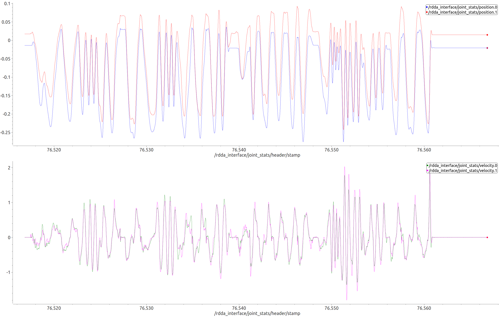

# rdda_interface
The rdda_interface is a ROS package developed for RDDA control library. 
It lets users control the 2-DOF remote-direct-drive gripper on ROS by sharing the input/output data 
between the ROS interface proccess and the gripper control process (based on RDDA library) using shared-memory technique.
rdda_interface is mainly responsible for:
- data synchronization for joint states and commanded reference between high-level ROS nodes and low-level controller,
- dynamical parameters tuning (e.g. max velocity/torque and stiffness),
- data collection and visualization.

## Table of Contents
1. [Requirements](#requirements)
2. [Installation](#installation)
3. [Joint Control](#joint-control)
4. [Parameter Tuning](#parameter-tuning)
5. [Data Collection & Visualization](#data-collection--visualization)

## Requirements
1. [ROS Kinetic](http://wiki.ros.org/kinetic/Installation/Ubuntu)
3. [RDDA Control Library](https://github.com/RoboticsCollaborative/RDDA)

## Installation
The following instruction have been tested on **Ubuntu 16.04**.
Similar instructions should not work for other Linux distributions.

1. Install [ROS Kinetic](http://wiki.ros.org/kinetic/Installation/Ubuntu). 
If you have ROS Kinetic installed, you should be good to go.

2. Install [RDDA Control Library](https://github.com/RoboticsCollaborative/RDDA)

3. Clone the repository into the ROS package directory:
    ```
    git clone https://github.com/RoboticsCollaborative/rdda_interface
    ```
   
4. Go to the directory of ROS workspace, then build the package:
    ```
    cd $<workspace>
    catkin_make
    ```
5. If you can launch the interface, then you should be good to control the gripper:
    ```
    roscd rdda_interface
    roslaunch rdda_interface rdda_interface.launch
    ```   
    A test to stream joints data with [plotJuggler](https://github.com/facontidavide/PlotJuggler).
    
      
## Joint Control
Obtain following joint states by subscribing to *"rdda_interface/joint_states"* ROS topic 
with [sensor_msgs/JointState](http://docs.ros.org/melodic/api/sensor_msgs/html/msg/JointState.html) message.
- float64[] position    ~   joint angles w.r.t. motor coords (rad)
- float64[] velocity    ~   joint angles w.r.t. motor coords (rad/s)
- float64[] effort      ~   external torque/force (Nm)

Publish joint reference positions to *"rdda_interface/joint_cmds"* 
with [trajectory_msgs/JointTrajectoryPoint](http://docs.ros.org/melodic/api/trajectory_msgs/html/msg/JointTrajectoryPoint.html) message.
- float64[] positions   ~   joint reference position (rad)

## Parameter Tuning
rdda_interface provides ROS services to tune dynamical parameters at runtime.
- Velocity saturation     ~   "/rdda_interface/set_max_vel" (rad/s)
- Effort/torque saturation    ~   "/rdda_interface/set_max_eff" (Nm)
- Stiffness     ~   "/rdda_interface/set_stiff" (Nm/rad)


## Data Collection & Visualization
Monitor the streaming data with [plotJuggler](https://github.com/facontidavide/PlotJuggler).